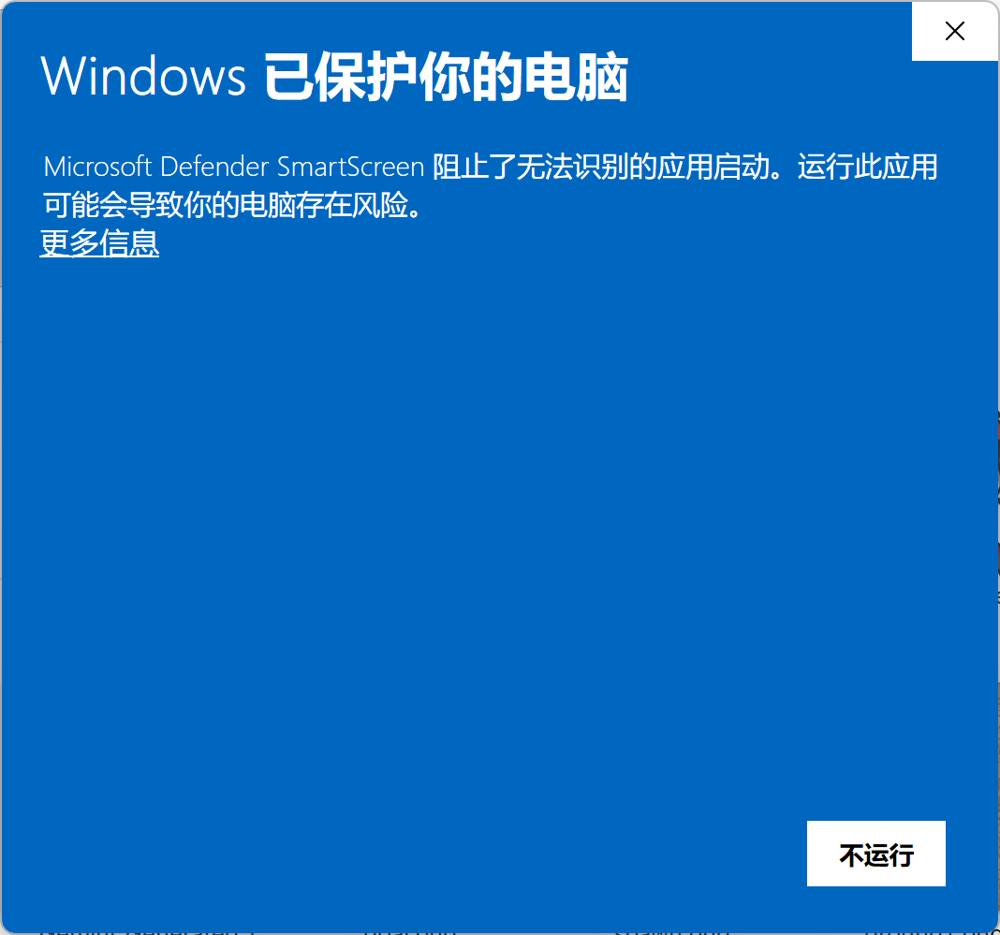
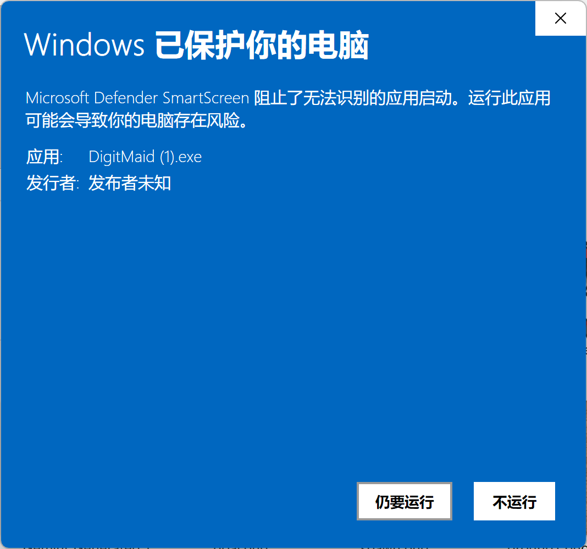
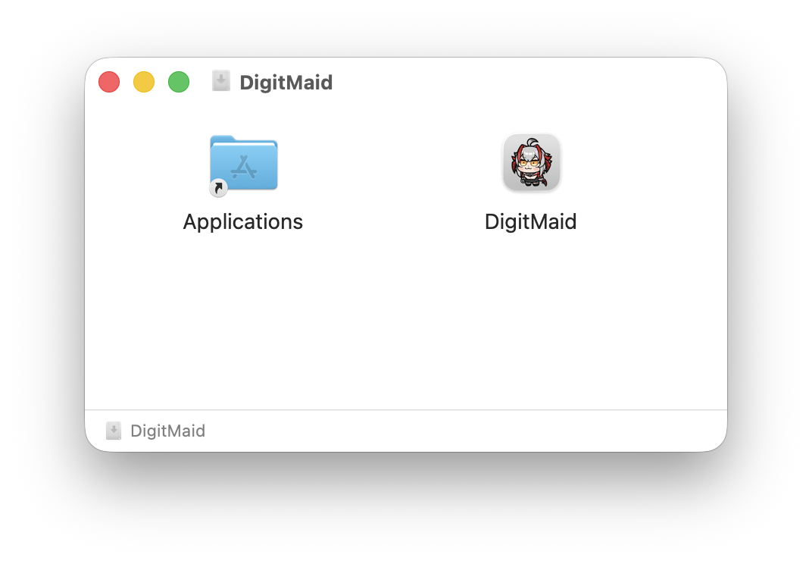
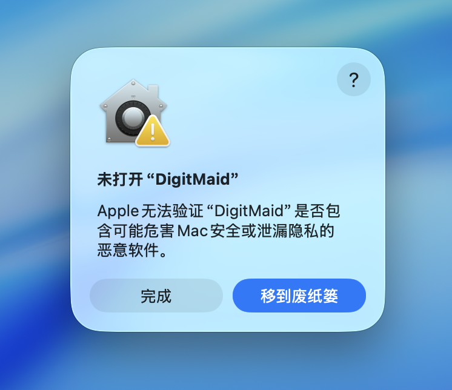
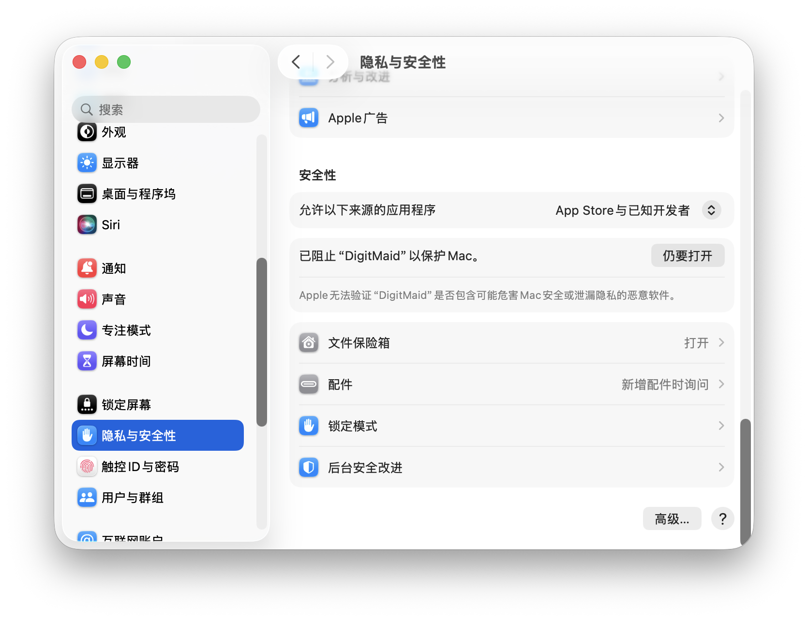

# DigitMaid 下载与安装指南

本文档用于帮助你快速下载并安装 DigitMaid，并解决上常见的“无法安装/无法打开”问题。

## 1. 下载方式

1. 打开项目的 Releases 页面。
2. 根据你的系统下载对应安装包：
- Windows: `DigitMaid.exe`
- macOS: `DigitMaid.dmg`

## 2. Windows 安装步骤

1. 双击下载的 `DigitMaid.exe`。
2. 若出现 SmartScreen 提示，点击“更多信息”后选择“仍要运行”。

## 3. macOS 安装步骤

1. 双击下载的 `DigitMaid.dmg`。
2. 在打开的安装窗口中，将 `DigitMaid.app` 拖入 `Applications`（应用程序）文件夹。

3. 打开“应用程序”启动 DigitMaid。

## 4. macOS 无法安装/无法打开（重点）

如果你遇到以下提示之一：
- “无法验证开发者”
- “Apple 无法检查其是否包含恶意软件”

请按下面步骤在“隐私与安全性”中放行：

1. 打开“系统设置” -> “隐私与安全性”。
2. 向下滚动到“安全性”区域。
3. 看到“DigitMaid.app 已被阻止使用”后，点击“仍要打开”。

4. 再次尝试启动 DigitMaid，并在弹窗中点击“打开”。

如果你使用的是旧版 macOS（Monterey 及更早），入口可能是：
- “系统偏好设置” -> “安全性与隐私” -> “通用” -> “仍要打开”。

## 5. 为什么会出现这个问题
### **钱包不允许穷学生给 Windows 和 Apple 交“证书税”**

哭了
