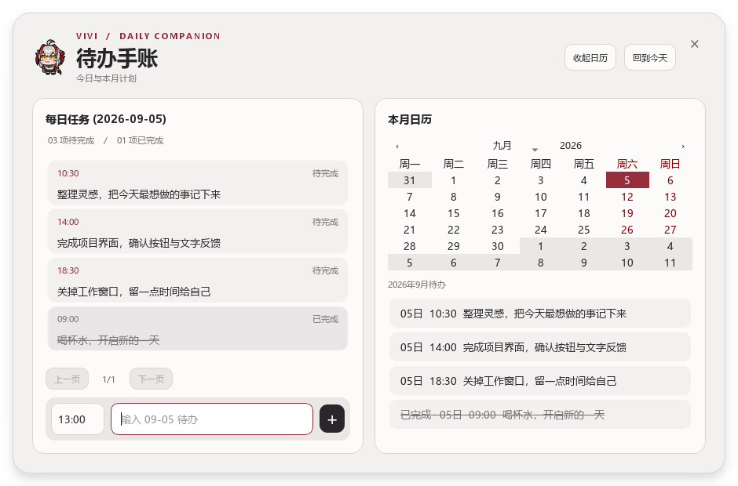
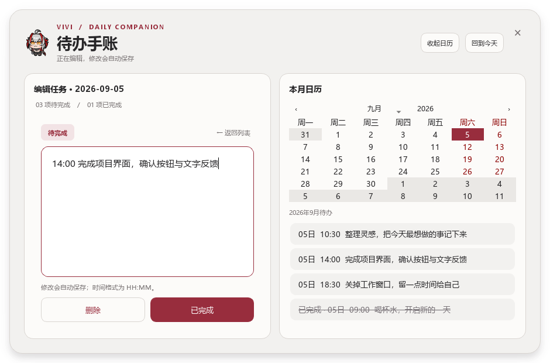
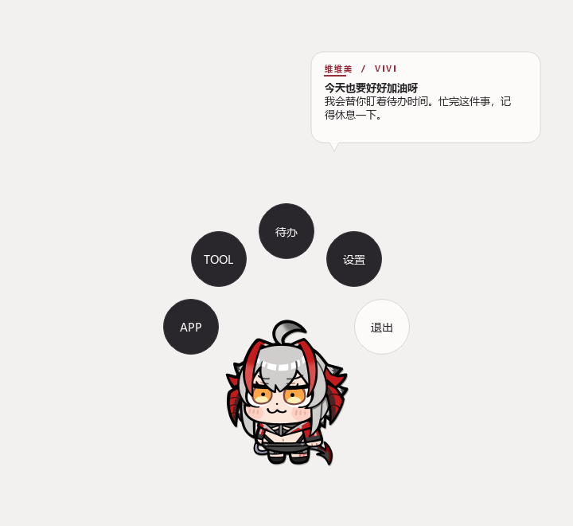

# Digit Maid 中文使用手册

适用于维维美统一主题版本。角色美术沿用项目已有素材，本项目为非官方桌面伴侣。

## 环境与安装

- Python 3.9 或更高版本
- Windows 10/11、macOS 或主流 Linux 桌面环境

安装依赖：

```bash
python -m pip install -r requirements.txt
```

当前唯一运行依赖是 PyQt6。项目内置了只支持映射、标量和标量列表的受限 YAML 解析器，因此不再要求安装 PyYAML，也不会执行 YAML 标签、引用或 Python 对象构造器。

## 运行

推荐从仓库根目录以模块方式启动：

```bash
python -m src
```

为兼容旧脚本和 PyInstaller，也可以运行：

```bash
python src/core/run.py
```

程序使用共享内存锁限制为单实例；如果 Digit Maid 已在运行，第二次启动会直接退出。

安装包的下载与使用说明见 [下载与安装指南](DOWNLOAD_GUIDE.md)。

## 使用说明

### 菜单与移动

- 右键桌宠打开菜单。
- 在 `TOOL -> 系统工具 -> 控制移动` 中进入键盘控制。
- `A/D` 或 `←/→` 水平移动，`W/↑/空格` 上升，`S/↓` 快速下落，`Esc` 退出控制。
- 在设置中可以修改桌宠大小、下落模式、待机模式、置顶状态和开机自启动。

### 待办面板

- 从菜单选择“待办”。
- 时间默认填入当前时间；输入内容后按回车或「+」新增任务。每页四项，正文过长可悬停查看完整内容。
- 点击任务后，整个「每日任务」区域切换为编辑页。输入格式为 `HH:MM 正文`，停止输入 0.6 秒后自动保存，也可以点击「返回列表」或按 Esc 保存并返回。
- 日历支持按日查看、月份汇总以及“回到今天”。
- 进入临期保护时间后，桌宠会从侧栏回到桌面，并在截止前禁止再次贴边隐藏。
- 进入提醒时间后，每 10 分钟弹出临期待办；弹窗只提供“标记已完成”和“p 分钟后提醒”，不会自行关闭。标记完成会保留事项并写入 `completed: true`，已完成事项不再参与提醒。
- 编辑页底部显示「删除」和「已完成／未完成」。点击「已完成」会将当前修改和完成状态一起保存，随即显示反馈、切换按钮文字并锁定正文。已完成事项保留在列表底部，以银灰底色和删除线区分；点击「未完成」后可继续编辑。

时间必须在 `00:00–23:59` 之间，正文最多 500 字，不能只有空白或含控制字符。单日最多 500 项、总共最多 5000 项。保存失败会保留输入并显示错误；非法草稿不会被标记完成，切换日期或关闭时会提示先修正。完成提醒弹窗中的任务前会先保存编辑页草稿，防止刷新丢失刚输入的内容。






待办保存在系统应用数据目录下的 `todo_items.json`。写入采用临时文件加原子替换，异常中断不会覆盖原文件；损坏或超大文件也会保留，方便手动恢复。

### Codex 状态桥接

默认状态文件为系统应用数据目录下的 `codex_status.json`。也可在启动 Digit Maid 前设置：

Codex 状态气泡会显示约 8 秒，普通操作提示仍保持约 2 秒，便于阅读较长的任务状态。

```bash
# PowerShell
$env:DIGITMAID_CODEX_STATUS_PATH = "D:\path\to\codex_status.json"

# bash/zsh
export DIGITMAID_CODEX_STATUS_PATH="/path/to/codex_status.json"
```

状态文件示例：

```json
{
  "task": "更新桌宠",
  "status": "运行中",
  "step": "执行测试",
  "detail": "安全检查已完成",
  "updated_at": "2026-08-31 12:00:00"
}
```

## 配置

所有可编辑配置集中在 `config/`：

- `menu.yaml`：定义 APP/TOOL 分类、内置工具动作和跨平台启动路径。
- `maid_animations.yaml`：动作素材、循环方式、下落和待机默认值。
- `dialog_style.yaml`：菜单模式与可选原始按钮贴图。统一配色在 `src/ui/theme/` 中维护。
- `todo.yaml`：DDL 桌面保护时间 `n`、弹窗提醒时间 `m` 和稍后提醒分钟数 `p`。

`config/todo.yaml` 位于仓库根目录的配置文件夹，并会随发布包一起打包。默认值为：提前 2 小时禁止贴边隐藏（`n`）、提前 1 小时开始弹窗（`m`）、点击稍后提醒后等待 30 分钟（`p`）。修改后重启 Digit Maid 生效；当天已经超时但尚未完成的事项仍会提醒，到午夜自动退出临期范围。

### 管理 APP 与 TOOL

编辑 `config/menu.yaml`：

```yaml
menus:
  APP:
    开发:
      我的编辑器:
        launch:
          - 'C:\Program Files\Editor\editor.exe'
          - /Applications/Editor.app
          - editor
    GAME:
      Steam:
        launch:
          - 'C:\Program Files (x86)\Steam\steam.exe'
          - /Applications/Steam.app
          - steam

  TOOL:
    系统工具:
      截图:
        action: screenshot
      控制移动:
        action: keyboard_control
    网络:
      VPN:
        launch:
          - 'D:\Tools\VPN\vpn.exe'
```

`APP` 和 `TOOL` 是完全独立的菜单树，普通映射表示分类，最多嵌套 4 层：

- `launch` 表示外部启动项，既可用于 APP，也可用于 VPN 等 TOOL；其中的路径会进入统一安全白名单。
- `action` 表示内置工具，目前支持 `screenshot`、`keyboard_control` 和 `codex_status`，只能放在 TOOL。
- 所有 `launch` 项的名称必须全局唯一，避免不同分类指向不明确的启动目标。
- YAML 列表的短横线后必须保留一个空格，例如 `- D:\Tools\app.exe`；格式错误会在桌宠对话中显示具体原因。

上例分别生成 `APP -> 开发 -> 我的编辑器`、`APP -> GAME -> Steam`、`TOOL -> 系统工具` 和 `TOOL -> 网络 -> VPN`。

程序不会把未配置的文本当作命令执行，候选路径也不会通过 shell 解释。列表菜单和圆形菜单都在每次打开时重新读取配置，修改后无需改代码或重启程序。

### 修改动画

动画素材必须位于仓库的 `resource/` 目录内，动作文件必须为不含路径分隔符的 `.gif` 文件名：

```yaml
base_dir: resource/wisdel/皮肤素材/可用素材
fall_mode: smooth
idle_mode: default

actions:
  idle: relax.gif
  special: special0.gif, special1.gif

loops:
  idle: true
  special: false
```

用户在界面中修改的下落、待机和缩放设置会通过 `QSettings` 保存，并优先于配置文件默认值。

## 界面风格与自定义

维维美主题使用银白背景、炭黑菜单、深红主操作和少量琥珀色临期提示。窗口标题区使用项目自带的角色图，正文保持常规字重；周末维持深红色，选中日期使用白字。

`config/dialog_style.yaml` 的常用配置：

| 字段 | 默认值 | 作用 |
| --- | --- | --- |
| `menu_style` | `circular` | `circular` 为环形菜单，`list` 为列表菜单 |
| `circular_button_mode` | `default` | 统一主题矢量按钮；`image` 恢复原始贴图按钮 |
| `circular_btn_select/quit/off` | 原资源路径 | 图片模式所用素材 |
| `outline_button_text` | `false` | 图片模式的文字描边 |
| `outline_dialog_bubble` | `false` | 对话卡片的加深边框 |

截图和数值输入窗口使用统一卡片，不再从旧背景图片拉伸生成窗口。历史配置中的 `background`、`btn_*_normal/hover/pressed` 和 `outline_dialog_text` 不再参与工具窗口排版。



普通操作消息约显示 2 秒，Codex 状态约显示 8 秒。长消息限制卡片高度并提供滚动；气泡会跟随桌宠所在屏幕，关闭后释放跟随计时器。环形菜单靠边时会整体平移，极端缩放时会缩小到可用工作区内。

## 数据备份与常见问题

- **数据在哪里？** 以 Qt 的 `QStandardPaths.AppDataLocation` 为准，源码启动与打包程序可能因应用名不同而使用不同目录。不要直接删除 AppData。可在仓库根目录运行以下只读命令定位：

  ```bash
  python -c "from src.function.todo_store import get_todo_data_path; print(get_todo_data_path())"
  ```

- **迁移待办**：先退出桌宠，备份原目录中的 `todo_items.json`，再复制到目标运行方式对应的数据目录。不要在程序运行时手工覆盖。
- **保存失败**：检查数据目录权限和磁盘空间。不要删掉原 JSON 重试；损坏、超大文件会原样保留，方便恢复。
- **贴边隐藏突然不可用**：检查是否有临期待办进入 n 小时保护区；完成事项或截止日跨过午夜后会退出保护。
- **配置改了没生效**：菜单每次打开重新加载；提醒阈值和动画配置修改后重启。打包程序配置位置见下文。
- **周末字色不同**：深红是周末日期，深红底白字是当前选中日期，浅琥珀底是今天。
- **Linux 中文缺字**：安装系统中文字体，例如 Noto Sans CJK；其他平台使用微软雅黑或苹方。
- **第二次启动直接退出**：单实例锁检测到已有桌宠，请先退出旧进程。
- **提醒无法关闭**：这是待办设计，只能完成或稍后提醒；程序整体退出不受影响。

## 打包配置的位置

所有源代码配置都在仓库根目录 `config/`，开发时不依赖当前工作目录。三个 spec 将 `config/` 与 `resource/` 一同打包。

Windows 当前使用 PyInstaller 单文件 EXE：运行时配置会解压到临时资源目录，因此修改源码配置后需重新打包；不要把临时解压目录当成持久设置目录。macOS/Linux 包的配置随 bundle 一同发布。待办 JSON 与这些只读资源分开保存。

构建入口与平台说明见 [下载指南](DOWNLOAD_GUIDE.md)；代码维护、验证命令及目录责任见 [维护指南](ARCHITECTURE.md)。
